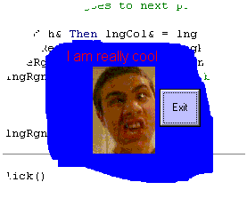

## Make a form a cool shape with using masks and BitBlt as shown in Methodus Toolz

### Description

Make a form a cool shape using masks and stuff. USes API also. Its mucho cool, and good to learn from. pretty short too. YOu can skin the form any way you want, it loads gif's, jpg's and bmp's, but i was too lazy to make a cool one, so i made a dumb blue one, but you can do whatever you want. Look at the skins on methodus toolz(www.methodus2000.com)...I made a bunch of those, and they are shaped all cool, with good graphics. THIS SAME THING WAS USED TO MAKE THE SHAPE OF THE FORM IN THE AWESOME PROGRAM METHODUS TOOLZ!!

plz rate. Portion of this was created bu DoS
 
### More Info
 

             |
---                |---
**Submitted On**   |2001-01-17 20:35:42
**By**             |[Jump0ffabuilding](https://github.com/Planet-Source-Code/PSCIndex/blob/master/ByAuthor/jump0ffabuilding.md)
**Level**          |Intermediate
**User Rating**    |2.7 (16 globes from 6 users)
**Compatibility**  |VB 6\.0
**Category**       |[Windows API Call/ Explanation](https://github.com/Planet-Source-Code/PSCIndex/blob/master/ByCategory/windows-api-call-explanation__1-39.md)
**World**          |[Visual Basic](https://github.com/Planet-Source-Code/PSCIndex/blob/master/ByWorld/visual-basic.md)
**Archive File**   |[CODE\_UPLOAD138651172001\.zip](https://github.com/Planet-Source-Code/jump0ffabuilding-make-a-form-a-cool-shape-with-using-masks-and-bitblt-as-shown-in-methodus__1-14486/archive/master.zip)

### API Declarations

included in zip

